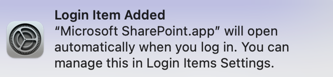

# LoginItemsCleaner
Apple Script to remove pesky programs from your Login Items list on macOS

Microsoft Edge and Google Chrome have started adding themselves to my Login Items list every time they launch. I have not found a way to keep this from happening. As a temporary workaround, I created a simple Apple Script to remove them. If found, a dialog will let you know. If not found, nothing happens. Add new items to the array at top of script.

# Directions
Open the .applescript file with "Script Editor.app". You can run from there or Export as Application to create a click-to-run app.
